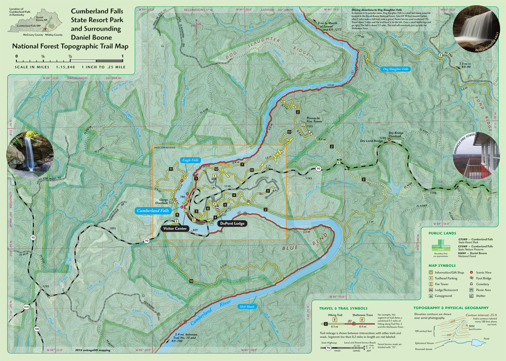

# Links to resources for my mapping project

## Photographs and maps 

     
Eagle Falls

     
Cumberland Falls

     
Above Cumberland Falls at night

     
Restored fire tower

     
Cumberland Falls map

## Video on Vimeo

Get embed code.

<iframe src="https://player.vimeo.com/video/329365129" width="640" height="360" frameborder="0" allowfullscreen></iframe>

Photographs on Flickr

